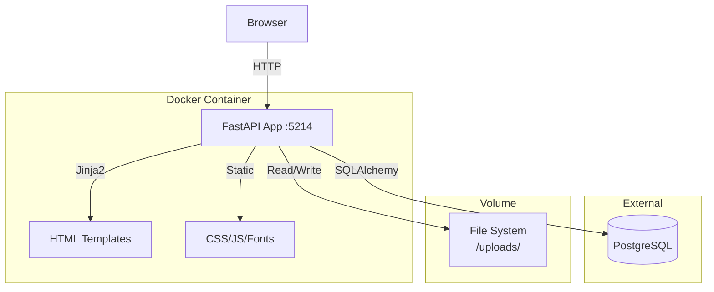
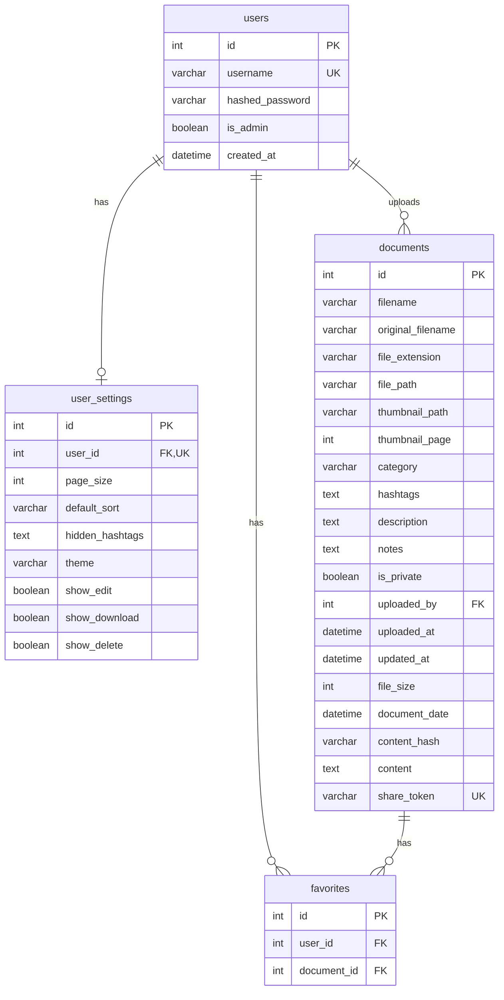
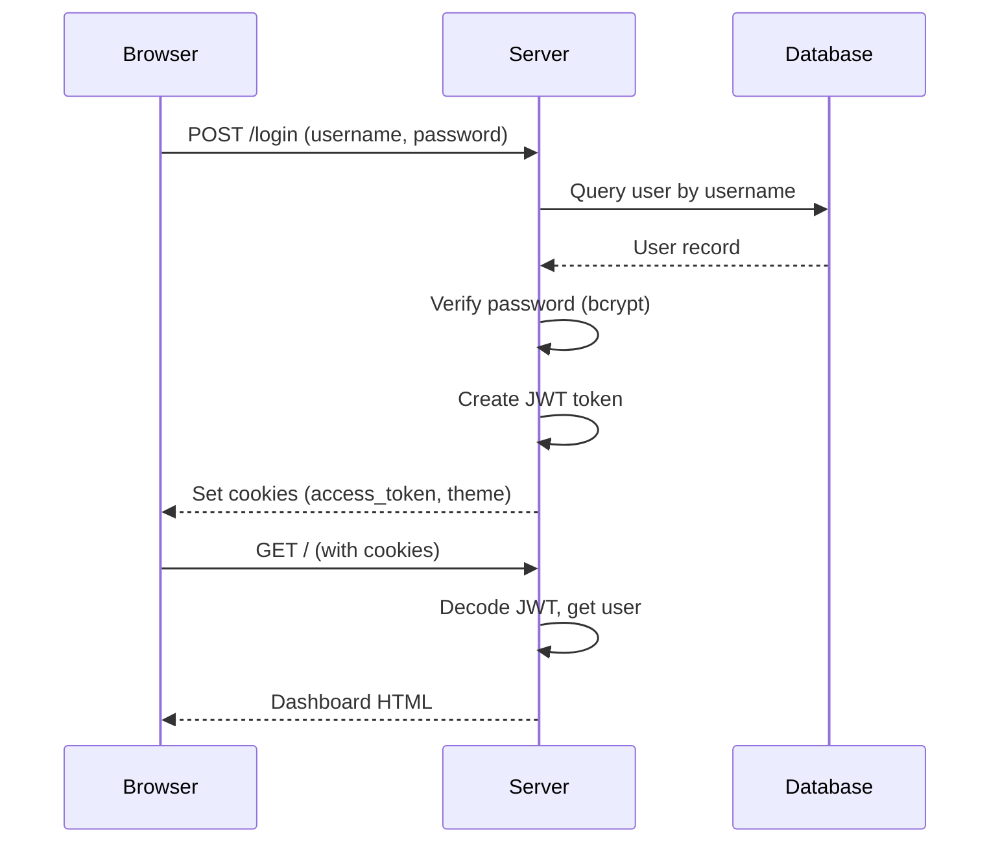
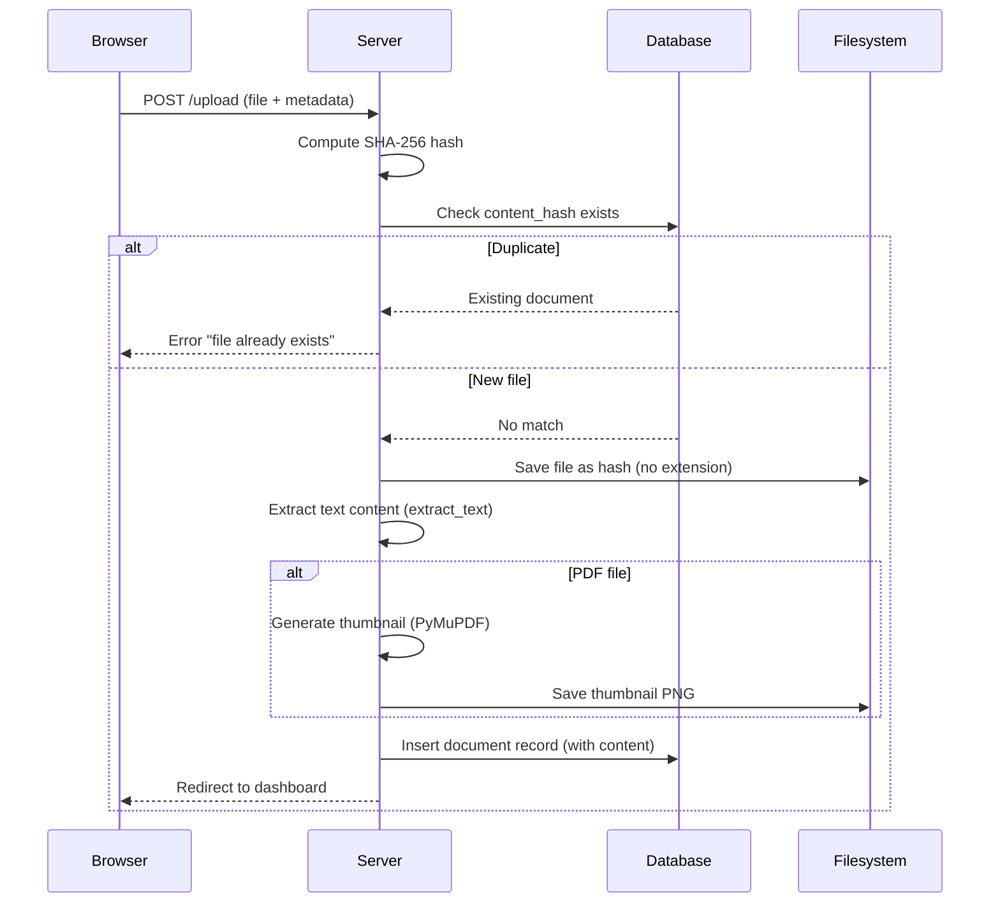
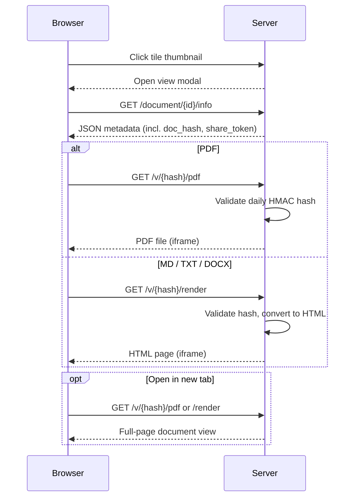
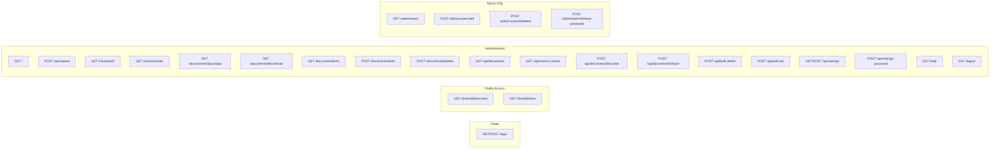
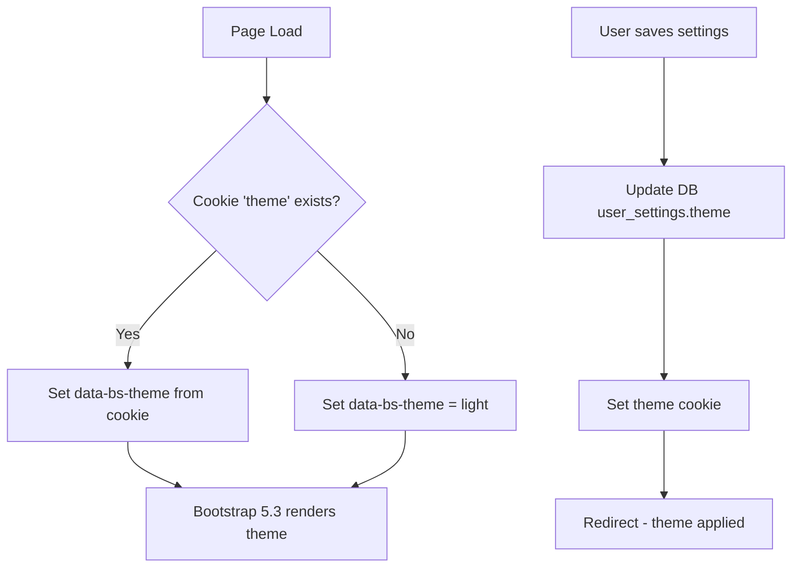

# Diagrams

**Author:** krse

## Application Architecture

```mermaid
graph TB
    Browser[Browser] -->|HTTP| FastAPI[FastAPI App :5214]
    FastAPI -->|SQLAlchemy| DB[(PostgreSQL)]
    FastAPI -->|Read/Write| FS[File System<br>/uploads/]
    FastAPI -->|Jinja2| Templates[HTML Templates]
    FastAPI -->|Static| Assets[CSS/JS/Fonts]

    subgraph Docker Container
        FastAPI
        Templates
        Assets
    end

    subgraph External
        DB
    end

    subgraph Volume
        FS
    end
```

## Database Schema

```mermaid
erDiagram
    users {
        int id PK
        varchar username UK
        varchar hashed_password
        boolean is_admin
        datetime created_at
    }

    user_settings {
        int id PK
        int user_id FK,UK
        int page_size
        varchar default_sort
        text hidden_hashtags
        varchar theme
        boolean show_edit
        boolean show_download
        boolean show_delete
    }

    documents {
        int id PK
        varchar filename
        varchar original_filename
        varchar file_extension
        varchar file_path
        varchar thumbnail_path
        int thumbnail_page
        varchar category
        text hashtags
        text description
        text notes
        boolean is_private
        int uploaded_by FK
        datetime uploaded_at
        datetime updated_at
        int file_size
        datetime document_date
        varchar content_hash
        text content
        varchar share_token UK
    }

    favorites {
        int id PK
        int user_id FK
        int document_id FK
    }

    users ||--o| user_settings : "has"
    users ||--o{ documents : "uploads"
    users ||--o{ favorites : "has"
    documents ||--o{ favorites : "has"
```

## Authentication Flow

```mermaid
sequenceDiagram
    participant B as Browser
    participant S as Server
    participant DB as Database

    B->>S: POST /login (username, password)
    S->>DB: Query user by username
    DB-->>S: User record
    S->>S: Verify password (bcrypt)
    S->>S: Create JWT token
    S-->>B: Set cookies (access_token, theme)
    B->>S: GET / (with cookies)
    S->>S: Decode JWT, get user
    S-->>B: Dashboard HTML
```

## Document Upload Flow

```mermaid
sequenceDiagram
    participant B as Browser
    participant S as Server
    participant DB as Database
    participant FS as Filesystem

    B->>S: POST /upload (file + metadata)
    S->>S: Compute SHA-256 hash
    S->>DB: Check content_hash exists
    alt Duplicate
        DB-->>S: Existing document
        S-->>B: Error "file already exists"
    else New file
        DB-->>S: No match
        S->>FS: Save file as hash (no extension)
        S->>S: Extract text content (extract_text)
        alt PDF file
            S->>S: Generate thumbnail (PyMuPDF)
            S->>FS: Save thumbnail PNG
        end
        S->>DB: Insert document record (with content)
        S-->>B: Redirect to dashboard
    end
```

## Document View Flow

```mermaid
sequenceDiagram
    participant B as Browser
    participant S as Server

    B->>S: Click tile thumbnail
    S-->>B: Open view modal
    B->>S: GET /document/{id}/info
    S-->>B: JSON metadata (incl. doc_hash, share_token)
    alt PDF
        B->>S: GET /v/{hash}/pdf
        S->>S: Validate daily HMAC hash
        S-->>B: PDF file (iframe)
    else MD / TXT / DOCX
        B->>S: GET /v/{hash}/render
        S->>S: Validate hash, convert to HTML
        S-->>B: HTML page (iframe)
    end
    opt Open in new tab
        B->>S: GET /v/{hash}/pdf or /render
        S-->>B: Full-page document view
    end
```

## Request Routing

```mermaid
graph LR
    subgraph Public
        LOGIN[GET/POST /login]
    end

    subgraph Public Access
        SHARED[GET /shared/token/view]
        SHAREDDL[GET /shared/token]
    end

    subgraph Authenticated
        DASH[GET /]
        UPLOAD[POST /api/upload]
        VIEW[GET /v/hash/pdf]
        RENDER[GET /v/hash/render]
        DL[GET /document/id/download]
        THUMB[GET /document/id/thumbnail]
        INFO[GET /document/id/info]
        EDIT[POST /document/id/edit]
        DEL[POST /document/id/delete]
        API[GET /api/documents]
        SEARCH[GET /api/search-context]
        FAV[POST /api/document/id/favorite]
        SHARE[POST /api/document/id/share]
        BULKDEL[POST /api/bulk-delete]
        BULKZIP[POST /api/bulk-zip]
        SETAPI[GET/POST /api/settings]
        CHPWAPI[POST /api/change-password]
        HELP[GET /help]
        LOGOUT[GET /logout]
    end

    subgraph Admin Only
        USERS[GET /admin/users]
        ADDUSER[POST /admin/users/add]
        DELUSER[POST /admin/users/id/delete]
        RESETPW[POST /admin/users/id/reset-password]
    end
```

## Theme System

```mermaid
flowchart TD
    A[Page Load] --> B{Cookie 'theme' exists?}
    B -->|Yes| C[Set data-bs-theme from cookie]
    B -->|No| D[Set data-bs-theme = light]
    C --> E[Bootstrap 5.3 renders theme]
    D --> E

    F[User saves settings] --> G[Update DB user_settings.theme]
    G --> H[Set theme cookie]
    H --> I[Redirect - theme applied]
```
